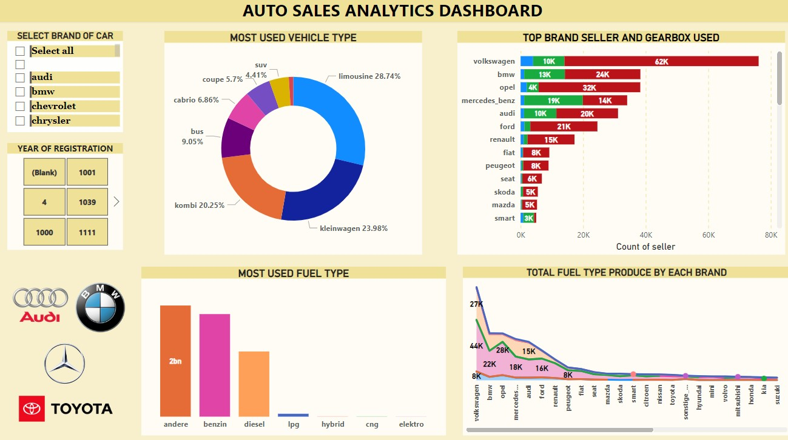
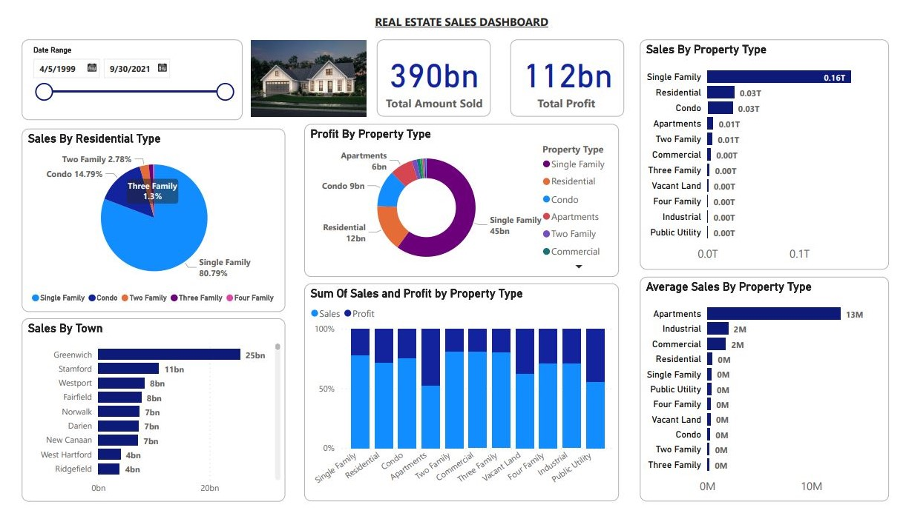
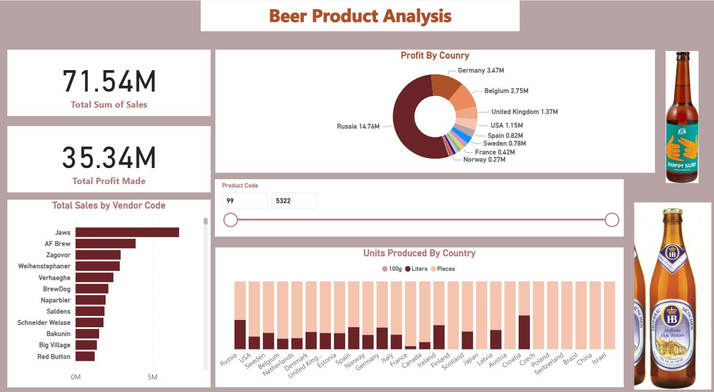

# Project 1: AUTO SALES DASHBOARD

* DATA was taken from KAGGLE DATASETS
* This Dashboard is mainly focused on the Brand Of Cars
* LIMOUSINE is the most used vehicle type
* ANDERE is the most used fuel type
* VOLKSWAGEN has the highest Gearbox used with Manual at 62k
* Highest Brand Seller VOLKSWAGEN
* ANDERE is the most used fuel type with a Total of 2bn 

# POWER BI IMAGE SHOWING THE INSIGHTS FROM THE DATA

# Project 2: REAL ESTATE SALES DASHBOARD

* DATA was taken from KAGGLE DATASETS
* Total Amount of Properties Sold is 390 Billion
* Total Profit made is 112 Billion
* Singe Family has the Highest Sales By Residential Type (at 80.79%)
* Total Profits of 45 Billion was made on total sales of Single Family Type
* GREENWICH town has the highest Sales (25 Billion)
* APARTMENT have the second highest profit made and also the highest on Average sales

# POWER BI IMAGE SHOWING THE INSIGHTS FROM THE DATA

# Project 3: BEER PRODUCT 

* DATA was taken from KAGGLE DATASETS
* Total profit made is 35.34M
* Total Amount of Sales is 71.54M
* Russia has the highest Sales and highest Profit Made at 14.76M
* Russia Has the highest Units Produce in Litres at 43.3% and Pieces at 56.64%
* By Vendor Code Jaws Beer Product Has The Highest Sales Followed by AF Brew

# DATA DASHBOARD

